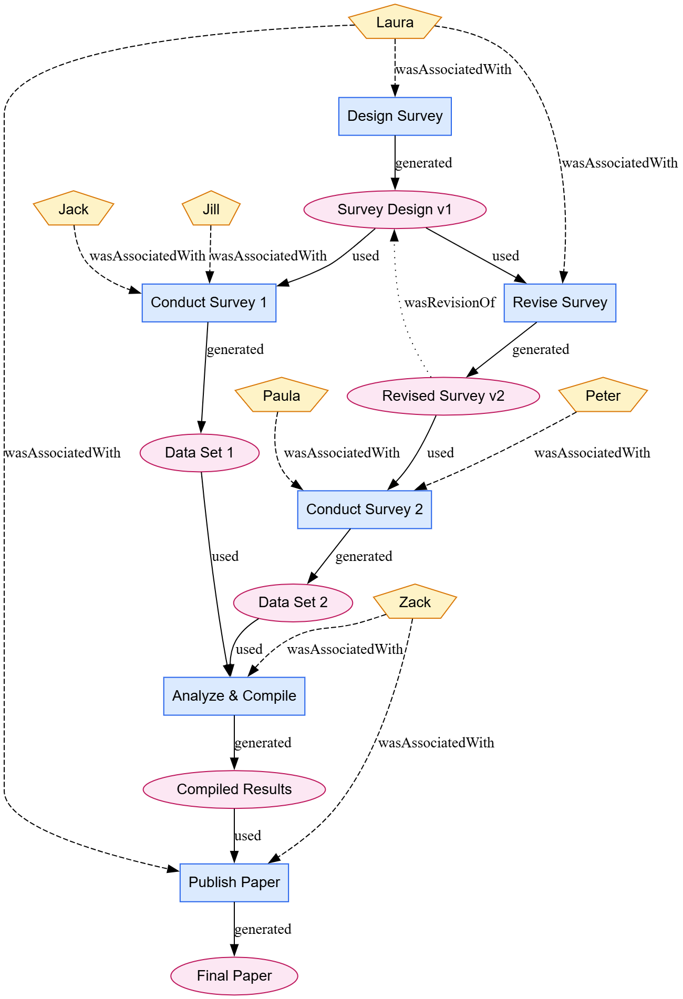

# Seminar: The Scientific Paper of the Future (SPF)

## Exercise 1: Software Publication and Preservation

[](https://doi.org/10.5281/zenodo.18854979)


### Description
This repository, named `data-science-seminar`, contains a sample Python script and metadata developed for the practical exercise 1 of the "Scientific Paper of the Future" seminar (UPM 2026). The primary goal of this exercise is to implement open science best practices, including permanent digital identifiers (DOI), standardized metadata, and clear licensing for scientific software.

### Content
- `analysis.py`: A basic Python script that calculates circle areas as a placeholder for scientific code.
- `codemeta.json`: Software metadata in a machine-readable format following the CodeMeta standard.
- `LICENSE`: Full text of the Apache License 2.0.

### Installation & Usage
To run the script, ensure you have Python 3 installed on your system:
```bash
python analysis.py

```

### How to Cite

If you use this software or the methodology described in this seminar exercise, please cite it as follows:

**Germán Gil Planes**. (2026). *data-science-seminar* (Version v1.0.0). GitHub. https://github.com/germaangil/data-science-seminar. DOI: 10.5281/zenodo.18854980

### License

This project is licensed under the **Apache License 2.0**. This is a permissive license that allows for reuse, modification, and distribution while requiring attribution. See the `LICENSE` file for the full text.

## Exercise 2: Representing Provenance (Practical Exercise)

This section documents the research lifecycle of the student financial support survey scenario (Laura's project), modeled according to the **W3C PROV-O** standard.

### Provenance Diagram
The following diagram illustrates the workflow, showing how the survey evolved and how different agents collaborated to produce the final paper.




### Detailed PROV Relations
Based on the exercise requirements and the diagram provided:

1. **Entities**: 
    - `Survey Design v1`, `Revised Survey v2`, `Data Set 1`, `Data Set 2`, `Compiled Results`, and `Final Paper`.
2. **Activities**: 
    - `Design Survey`, `Conduct Survey 1 & 2`, `Revise Survey`, `Analyze & Compile`, and `Publish Paper`.
3. **Use and Generation**: 
    - Activities like *Conduct Survey 1* **used** `Survey Design v1` and **generated** `Data Set 1`.
    - The *Publish Paper* activity **used** `Compiled Results` to **generate** the `Final Paper`.
4. **Agents**: 
    - **Laura** (Designer/Reviser), **Jack & Jill** (Collectors 1), **Peter & Paula** (Collectors 2), and **Zack** (Analyst).
5. **Revision and Derivation**: 
    - `Revised Survey v2` is explicitly marked as **wasRevisionOf** `Survey Design v1`.
    - The flow shows the `Final Paper` is derived from the preceding activities and entities.
6. **Plans**: 
    - `Survey Design v1` and `Revised Survey v2` act as the **Plans** used by the data collection activities (*Conduct Survey 1 & 2*).